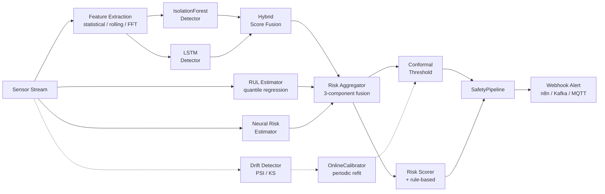

# AI-CTA: AI-Industrial Predictive Safety
[](https://opensource.org/licenses/MIT)
[](https://www.python.org/downloads/)
[](https://github.com/Allarayzer/ai-industrial-predictive-safety/actions/workflows/ci.yml)
[](CHANGELOG.md)
[](https://orcid.org/0009-0009-1548-390X)
[](https://zenodo.org/)
> Reference implementation of a predictive safety framework for high-hazard
> industrial facilities. Integrates Isolation Forest, LSTM, RUL quantile
> regression, neural risk modelling, conformal calibration, and three-component
> risk fusion behind a streaming pipeline and a REST API.
## Overview
Industrial accidents at high-hazard facilities — nuclear power plants,
chemical processing sites, railway and pipeline infrastructure — often
occur not because anomalies were invisible, but because existing
monitoring systems reported them too late or buried them in false alarms.
This project implements a layered, AI-based detection and alerting stack
that targets the narrow window between the first deviation from nominal
behaviour and the onset of failure.
The code accompanies the monograph:
> Serebriakov, I. (2026). *Artificial Intelligence for Preventing Accidents
> at High-Risk Industrial Facilities.* Ridero.
## Features
- **Multi-family feature extractors** for multivariate sensor streams:
  statistical moments, crest factor, rolling-window aggregations, and
  FFT-based spectral descriptors.
- **Anomaly detectors** — `IsolationForestDetector` with integrated
  feature engineering, `LSTMDetector` based on prediction residuals,
  and `HybridDetector` combining the two with optional weight tuning.
- **Remaining Useful Life** (`RULEstimator`) — multi-quantile LSTM
  regressor with a pinball loss; recovers a horizon-conditioned failure
  risk via `risk_at_horizon()`.
- **Neural risk estimator** (`NeuralRiskEstimator`) — feedforward
  classifier with cost-asymmetric BCE that turns recent telemetry,
  operational context, and asset history into a probability of failure
  within a target horizon.
- **Three-component risk aggregation** (`RiskAggregator`) — convex
  combination R_final = w₁·R_anom + w₂·R_RUL + w₃·R_NN with weights
  calibrated via SLSQP on a labelled validation set.
- **Conformal Risk Control** (`ConformalThresholdCalibrator`) — split
  conformal prediction with finite-sample correction for guaranteed
  marginal false-alarm rate.
- **Online recalibration** (`OnlineCalibrator`) — sliding-window
  threshold updates on a configurable schedule.
- **Distribution drift detection** (`DriftDetector`) — Population
  Stability Index and Kolmogorov-Smirnov methods.
- **Composite risk scoring** (`RiskScorer`) — interpretable channel-wise
  exceedances combined with the ML score.
- **Industrial telemetry simulator** (`IndustrialSimulator`) — full
  multi-sensor generator with seasonal components, multi-mode
  degradation, and Poisson-process anomaly events.
- **Streaming pipeline** (`SafetyPipeline`) — orchestrates the full loop
  from raw readings to n8n-compatible webhook alerts.
- **REST API service** — FastAPI endpoints for online scoring.
- **Benchmark scripts** for NASA C-MAPSS and CWRU bearing datasets.
- **Docker reference deployment** with API, n8n, Postgres, and Redis.
## Architecture

See [`docs/architecture.md`](docs/architecture.md) for component-level
description and design rationale.
## Installation
Requires Python 3.10 or newer.
```bash
git clone https://github.com/Allarayzer/ai-industrial-predictive-safety.git
cd ai-industrial-predictive-safety
# Core install (Isolation Forest, risk scoring, streaming pipeline)
pip install -e .
# With deep-learning support (LSTM, RUL, Neural Risk)
pip install -e ".[deep]"
# With REST API service
pip install -e ".[api]"
# Full install including benchmark tooling
pip install -e ".[all]"
```
## Quick Start
Train an Isolation Forest detector on a synthetic sensor stream, calibrate
its threshold with conformal prediction, and run the end-to-end pipeline:
```python
from ai_cta import (
    IsolationForestDetector,
    RiskScorer,
    SafetyPipeline,
    ConformalThresholdCalibrator,
)
from ai_cta.risk.scoring import ChannelLimits
from ai_cta.utils import generate_synthetic_stream, inject_anomalies
# 1. Prepare training and evaluation data
train = generate_synthetic_stream(n_samples=2000, random_state=0)
test, labels = inject_anomalies(
    generate_synthetic_stream(n_samples=1000, random_state=1),
    n_anomalies=20,
    random_state=1,
)
# 2. Fit the detector on known-normal data
detector = IsolationForestDetector(window_size=64, stride=32).fit(
    train.drop(columns=["timestamp"])
)
# 3. Calibrate the anomaly threshold (5% FAR target)
calibrator = ConformalThresholdCalibrator(alpha=0.05)
calibrator.calibrate(detector.decision_function(train.drop(columns=["timestamp"])))
# 4. Combine with rule-based channel limits
scorer = RiskScorer(
    ml_weight=0.6,
    limits={
        "temperature": ChannelLimits(40, 80, 20, 100),
        "vibration": ChannelLimits(0.1, 0.5, 0.0, 0.8),
    },
)
# 5. Run the streaming pipeline
pipeline = SafetyPipeline(
    detector=detector,
    risk_scorer=scorer,
    window_size=64,
    alert_threshold=0.7,
)
for event in pipeline.run(test.to_dict(orient="records")):
    print(f"{event.timestamp}  risk={event.risk_score:.3f}  level={event.risk_level}")
```
Full end-to-end walk-through: [`examples/quick_start.py`](examples/quick_start.py).
## REST API
A reference REST service wraps the pipeline (see monograph § 10.8):
```bash
pip install -e ".[api]"
uvicorn api.main:app --host 0.0.0.0 --port 8000
# Try it
curl -X POST http://localhost:8000/score \
  -H "Content-Type: application/json" \
  -d '{"temperature": 52.3, "vibration": 0.34, "pressure": 1.02}'
```
Interactive Swagger documentation at `http://localhost:8000/docs`.
See [`api/README.md`](api/README.md) for full details.
## Docker
A reference container stack (API + n8n + Postgres + Redis) is provided:
```bash
docker compose -f docker/docker-compose.yml up --build
```
See [`docker/README.md`](docker/README.md) for the deployment guide.
## Benchmarks
Reproducible evaluation scripts are provided for two widely-used public
datasets in the predictive-maintenance literature:
| Dataset | Task | Script |
|---------|------|--------|
| NASA C-MAPSS (FD001) | Turbofan remaining useful life / degradation flag | [`benchmarks/run_cmapss_benchmark.py`](benchmarks/run_cmapss_benchmark.py) |
| CWRU Bearing | Bearing fault classification | [`benchmarks/run_cwru_benchmark.py`](benchmarks/run_cwru_benchmark.py) |
Download the data first (see [`docs/benchmarks.md`](docs/benchmarks.md)),
then run:
```bash
python benchmarks/run_cmapss_benchmark.py
python benchmarks/run_cwru_benchmark.py
```
Each script writes a CSV of per-method metrics to `benchmarks/results/`.
## Repository Structure
```
ai-industrial-predictive-safety/
├── src/ai_cta/
│   ├── features/           # Feature extractors (statistical / rolling / FFT)
│   ├── detection/          # Anomaly detectors (IF, LSTM, hybrid)
│   ├── prognostics/        # RUL, Neural Risk, Drift, Online Calibration
│   ├── risk/               # Risk scoring, conformal calibration, aggregation
│   ├── streaming/          # End-to-end pipeline orchestration
│   └── utils/              # Synthetic data, simulator, evaluation
├── api/                    # FastAPI REST service
├── docker/                 # Dockerfile and docker-compose stack
├── tests/                  # pytest suite
├── examples/               # Quick-start demo
├── benchmarks/             # C-MAPSS and CWRU evaluation scripts
├── docs/                   # Architecture, API, benchmark documentation
├── .github/workflows/      # CI configuration
├── CITATION.cff
├── CHANGELOG.md
├── CONTRIBUTING.md
├── LICENSE
├── pyproject.toml
└── README.md
```
## Documentation
- [Architecture overview](docs/architecture.md)
- [Public API reference](docs/api.md)
- [Benchmark protocols and results](docs/benchmarks.md)
## Running the tests
```bash
pip install -e ".[test]"
pytest tests/
```
All 62 tests should pass on Python 3.10+.
## Citation
If you use this code in your research, please cite both the software and
the accompanying monograph:
```bibtex
@software{serebriakov_ai_cta_2026,
  author  = {Serebriakov, Ilia},
  title   = {{AI-CTA}: AI-Industrial Predictive Safety:
             A Reference Implementation for Preventive Safety Systems
             in High-Hazard Industrial Facilities},
  year    = {2026},
  version = {1.1.0},
  url     = {https://github.com/Allarayzer/ai-industrial-predictive-safety},
}
@book{serebriakov_monograph_2026,
  author    = {Serebriakov, Ilia},
  title     = {Artificial Intelligence for Preventing Accidents
               at High-Risk Industrial Facilities},
  year      = {2026},
  publisher = {Ridero},
}
```
## License
Released under the MIT License. See [LICENSE](LICENSE) for full text.
## Disclaimer
This is a research and educational reference implementation. It is **not
certified for direct use in safety-critical industrial deployments**.
Any operational use requires independent validation and conformance
review under the applicable regulatory framework (e.g., IEC 61508,
ISO 13849, IEC 62443 for industrial cybersecurity).
## Author
**Ilia Serebriakov**
Engineering Science, Borough of Manhattan Community College, CUNY
New York, NY, USA
- ORCID: [0009-0009-1548-390X](https://orcid.org/0009-0009-1548-390X)
- Email: allarayzer@gmail.com
- GitHub: [@Allarayzer](https://github.com/Allarayzer)
