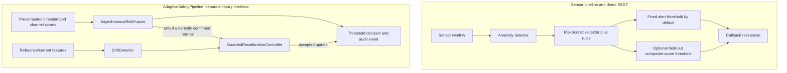

# AI-CTA: AI-Industrial Predictive Safety
[](https://opensource.org/licenses/MIT)
[](https://www.python.org/downloads/)
[](https://github.com/Allarayzer/ai-industrial-predictive-safety/actions/workflows/ci.yml)
[](CHANGELOG.md)
[](https://orcid.org/0009-0009-1548-390X)
[](https://doi.org/10.5281/zenodo.21145078)
[](https://doi.org/10.5281/zenodo.20535197)
AI-CTA is an open research implementation for industrial anomaly detection,
remaining-useful-life estimation, risk-score fusion, and threshold calibration.
It accompanies the monograph and two empirical studies. The current development
version is **1.2.2.dev0**; see [release and reproduction notes](docs/reproduction.md).

There are two distinct streaming interfaces. `SafetyPipeline` consumes sensor
readings and computes detector-plus-rules risk; the demo REST service uses this
interface. `AdaptiveSafetyPipeline` consumes **precomputed** channel scores and
handles asynchronous fusion, drift monitoring, and guarded threshold updates.
The REST service does not run the three-channel adaptive pipeline.

The monograph also discusses computer vision, digital twins, and SCADA integration.
These broader architectural proposals are not implementations provided by this
Python library. This is research software, without field-validation or safety
certification claims.

## Features
- **Multi-family feature extractors** for multivariate sensor streams:
  statistical moments, crest factor, rolling-window aggregations, and
  FFT-based spectral descriptors.
- **Anomaly detectors** — `IsolationForestDetector` with integrated
  feature engineering, `LSTMDetector` based on prediction residuals,
  and `HybridDetector` combining the two with optional weight tuning.
- **Remaining Useful Life** (`RULEstimator`) — multi-quantile LSTM
  regressor with a pinball loss; recovers a horizon-conditioned failure
  risk via `risk_at_horizon()`.
- **Neural risk estimator** (`NeuralRiskEstimator`) — feedforward
  classifier with cost-asymmetric BCE. Its output is a risk score;
  a calibrated failure probability requires separate validation.
- **Three-component risk aggregation** (`RiskAggregator`) — convex
  combination R_final = w₁·R_anom + w₂·R_RUL + w₃·R_NN with weights
  calibrated via SLSQP on a labelled validation set.
- **Conformal threshold calibration** (`ConformalThresholdCalibrator`) — split
  conformal thresholding with a marginal false-alarm bound under exchangeability
  of held-out normal calibration and test scores; not a guarantee under drift.
- **Online recalibration** (`OnlineCalibrator`) — sliding-window
  threshold updates on a configurable schedule.
- **Distribution drift detection** (`DriftDetector`) — Population
  Stability Index and Kolmogorov-Smirnov methods.
- **Composite risk scoring** (`RiskScorer`) — interpretable channel-wise
  exceedances combined with the ML score.
- **Industrial telemetry simulator** (`IndustrialSimulator`) — full
  multi-sensor generator with seasonal components, multi-mode
  degradation, and Poisson-process anomaly events.
- **Sensor streaming** (`SafetyPipeline`) — detector-plus-rules scoring and
  callbacks, with an optional calibrator fitted on held-out composite scores.
- **Adaptive streaming** (`AdaptiveSafetyPipeline`) — timestamped precomputed
  scores, stale-channel handling, drift checks, and guarded recalibration.
- **Regime thresholds** (`RegimeConformalCalibrator`) — per-regime calibration
  with a pooled fallback for unseen or undersampled regimes.
- **REST API service** — FastAPI endpoints for online scoring.
- **Benchmark scripts** for NASA C-MAPSS and CWRU bearing datasets.
- **Docker reference deployment** with API, n8n, Postgres, and Redis.
## Architecture

```mermaid
flowchart TB
    subgraph sensor[Sensor pipeline and demo REST]
        A[Sensor window] --> B[Anomaly detector]
        B --> C[RiskScorer: detector plus rules]
        C --> D[Fixed alert threshold by default]
        C --> E[Optional held-out composite-score threshold]
        D --> F[Callback / response]
        E --> F
    end
    subgraph adaptive[AdaptiveSafetyPipeline: separate library interface]
        G[Precomputed timestamped channel scores] --> H[AsynchronousRiskFusion]
        H --> I[Threshold decision and audit event]
        J[Reference/current features] --> K[DriftDetector]
        K --> L[GuardedRecalibrationController]
        H -->|only if externally confirmed normal| L
        L -->|accepted update| I
    end
```

See [`docs/architecture.md`](docs/architecture.md) for component-level
description and design rationale.
## Installation
Requires Python 3.10 or newer.
```bash
git clone https://github.com/Allarayzer/ai-industrial-predictive-safety.git
cd ai-industrial-predictive-safety
# Core install (Isolation Forest, risk scoring, streaming pipeline)
pip install -e .
# With deep-learning support (LSTM, RUL, Neural Risk)
pip install -e ".[deep]"
# With REST API service
pip install -e ".[api]"
# Full install including benchmark tooling
pip install -e ".[all]"
```
## Quick Start

From a repository checkout:

```bash
pip install -e .
python examples/quick_start.py
```

The example fits the detector on one stream, fits a threshold on the **composite
risk scores** of a separate known-normal stream, and applies that threshold to
callbacks on a third stream. It passes the fitted object explicitly:

```python
pipeline = SafetyPipeline(
    detector=detector,
    risk_scorer=scorer,
    window_size=64,
    risk_calibrator=calibrator,  # fitted on held-out detector-plus-rules scores
    alert_callback=alerts.append,
)
```

When `risk_calibrator` is omitted, callbacks use the fixed `alert_threshold`.
Risk-level labels always use the scorer's fixed bands. This time-series demo
illustrates API wiring: temporal dependence or distribution shift can invalidate
an exchangeability-based false-alarm bound.

## REST API
A reference REST service wraps the pipeline (see monograph § 10.8):
```bash
pip install -e ".[api]"
uvicorn api.main:app --host 0.0.0.0 --port 8000
# Canonical single-sample predict (book § 10.8)
curl -X POST http://localhost:8000/predict \
  -H "Content-Type: application/json" \
  -d '{"temperature": 52.3, "vibration": 0.34, "pressure": 1.02}'
# Alias (same handler, legacy spelling)
curl -X POST http://localhost:8000/score ...
```
Interactive Swagger documentation at `http://localhost:8000/docs`.
See [`api/README.md`](api/README.md) for full details.
## Docker
A 9-container reference stack (monograph § 12.5) is provided:
API, Postgres, Redis, n8n, MLflow, Grafana, Prometheus, InfluxDB, and
a telemetry simulator.
```bash
# Full stack (~8 GB RAM)
docker compose -f docker/docker-compose.yml up --build
# Minimal 4-service subset for local development
docker compose -f docker/docker-compose.yml up api postgres redis n8n
```
See [`docker/README.md`](docker/README.md) for the deployment guide.
## Experiments and benchmarks

Start with the protocol corresponding to the work you want to reproduce:

| Purpose | Entry point |
|---|---|
| PeerJ study: disjoint C-MAPSS fusion, cross-load CWRU, calibration, RUL and sensitivity analyses | [experiments/peerj/README.md](experiments/peerj/README.md) |
| Governed-adaptation study: controlled shifts, engine crossfit, battery replay | [experiments/paper2/README.md](experiments/paper2/README.md) |
| Dataset download instructions and historical demonstrations | [docs/benchmarks.md](docs/benchmarks.md) |

`benchmarks/run_cwru_benchmark.py`, `run_experiment_e2_cmapss.py`, and
`run_ablation.py` are historical exploratory scripts. They reuse training or
weight-calibration observations during evaluation and **must not be used as
held-out validation of the PeerJ results**. Corrected runners are under
`experiments/peerj/`. Historical outputs have not been replaced by new runs.

## Dataset Information

| Dataset | Source | License / terms | Access |
|---|---|---|---|
| NASA C-MAPSS (FD001–FD004) | NASA Prognostics Data Repository (Saxena et al., 2008) | US public domain | `benchmarks/download_cmapss.py` |
| CWRU Bearing | Case Western Reserve University Bearing Data Center | Free for academic use with citation | `benchmarks/download_cwru.py` |
| Bosch CNC Machining | github.com/boschresearch/CNC_Machining (Tnani, Feil & Diepold, 2022) | CC-BY-4.0 | see `docs/benchmarks.md` |

No proprietary or private data are used. The synthetic stream is generated by a
seeded simulator (`ai_cta.data.generate_synthetic_stream`); all benchmark data are
downloaded from their original public sources by the bundled scripts.

## Reproducibility

[Reproduction notes](docs/reproduction.md) distinguish archived study code,
reference results, and the current development version. The PeerJ snapshot
includes a SHA-256 manifest for imported scripts and unchanged reference CSVs.
The governed-adaptation package has its own provenance map.

Dependencies in `pyproject.toml` are compatibility lower bounds, **not an
environment lock**. Record Python/library versions, the Git commit, dataset
versions, and seeds for each run. Dataset downloads are explicit; availability
and bitwise identity of upstream mirrors are not guaranteed. Generated results
are kept separate from reference CSVs.

## Repository Structure

Core library, services, and study-specific experiment packages:

```
ai-industrial-predictive-safety/
├── src/ai_cta/
│   ├── preprocess.py         # feature extractors (statistical / rolling / FFT)
│   ├── anomaly_detector.py   # IsolationForest + LSTM + Hybrid detectors
│   ├── rul_estimator.py      # LSTM quantile-regression RUL estimator
│   ├── risk_model.py         # RiskScorer, RiskAggregator, ConformalCalibrator, NeuralRisk
│   ├── drift_detector.py     # PSI + KS population drift
│   ├── calibration.py        # OnlineCalibrator (scheduled recalibration)
│   ├── online_fusion.py      # timestamped asynchronous channel scores
│   ├── adaptive_calibration.py # guarded and per-regime thresholds
│   ├── adaptive_pipeline.py  # drift / threshold / audit events
│   ├── simulator.py          # IndustrialSimulator telemetry generator
│   ├── pipeline.py           # SafetyPipeline streaming orchestrator
│   ├── data.py               # generate_synthetic_stream, inject_anomalies
│   └── evaluation.py         # evaluate_binary_detector metrics
├── api/                    # FastAPI REST service (/predict, /score, /score-batch)
├── docker/                 # Dockerfile + 9-container docker-compose stack
├── configs/                # reference YAML settings (not auto-loaded)
├── n8n_workflows/          # integration guidance
├── notebooks/              # notebook guidance
├── tests/                  # unit and integration tests
├── examples/               # Quick-start demo
├── benchmarks/             # historical runners and dataset downloads
├── experiments/peerj/      # corrected study runners and reference CSVs
├── experiments/paper2/     # governed-adaptation replication package
├── docs/                   # Architecture, API, benchmark documentation
├── .github/workflows/      # CI configuration
├── CITATION.cff
├── CHANGELOG.md
├── CONTRIBUTING.md
├── LICENSE
├── pyproject.toml
└── README.md
```
## Documentation
- [Architecture overview](docs/architecture.md)
- [Public API reference](docs/api.md)
- [Benchmark protocols and results](docs/benchmarks.md)
## Running the tests
```bash
pip install -e ".[test]"
python -m pytest tests/
```
CI runs core/API tests on Python 3.10–3.12, and small TensorFlow loss/model
checks in a separate Python 3.11 job. To include these checks locally, install
`.[test,deep]`. Tests do not replace full benchmark or field validation.
## Citation

Cite the exact software version used. The example below refers specifically to
**archived v1.1.0**, DOI `10.5281/zenodo.21145078`; that DOI does not identify the
current development tree. For unreleased work, record the commit and repository
URL. See `CITATION.cff` and [reproduction notes](docs/reproduction.md).

```bibtex
@software{serebriakov_ai_cta_2026,
  author  = {Serebriakov, Ilia},
  title   = {{AI-CTA}: AI-Industrial Predictive Safety:
             A Reference Implementation for Preventive Safety Systems
             in High-Hazard Industrial Facilities},
  year    = {2026},
  version = {1.1.0},
  doi     = {10.5281/zenodo.21145078},
  url     = {https://github.com/Allarayzer/ai-industrial-predictive-safety},
}

@book{serebriakov_monograph_2026,
  author    = {Serebriakov, Ilia},
  title     = {Artificial Intelligence for Preventing Accidents
               at High-Risk Industrial Facilities},
  year      = {2026},
  publisher = {Zenodo},
  doi       = {10.5281/zenodo.20535197},
  url       = {https://doi.org/10.5281/zenodo.20535197},
}
```

If you reproduce the benchmark results, please also cite the
underlying datasets:

```bibtex
@inproceedings{saxena_cmapss_2008,
  author    = {Saxena, Abhinav and Goebel, Kai and Simon, Don and Eklund, Neil},
  title     = {Damage Propagation Modeling for Aircraft Engine Run-to-Failure Simulation},
  booktitle = {International Conference on Prognostics and Health Management (PHM)},
  year      = {2008},
  publisher = {IEEE},
}

@misc{nasa_cmapss_data,
  author = {{NASA Prognostics Center of Excellence}},
  title  = {{CMAPSS} Jet Engine Simulated Data},
  year   = {2008},
  url    = {https://data.nasa.gov/dataset/CMAPSS-Jet-Engine-Simulated-Data},
  note   = {Accessed via the PHM Society archive.},
}

@misc{cwru_bearing_data,
  author = {{Case Western Reserve University}},
  title  = {Bearing Data Center},
  url    = {https://engineering.case.edu/bearingdatacenter},
  note   = {Real-world bearing vibration dataset.},
}
```
## License
Released under the MIT License. See [LICENSE](LICENSE) for full text.
## Disclaimer
This is a research and educational reference implementation. It is **not
certified for direct use in safety-critical industrial deployments**.
Any operational use requires independent validation and conformance
review under the applicable regulatory framework (e.g., IEC 61508,
ISO 13849, IEC 62443 for industrial cybersecurity).
## Author
**Ilia Serebriakov**
Engineering Science, The City University of New York (CUNY)
New York, NY, USA
- ORCID: [0009-0009-1548-390X](https://orcid.org/0009-0009-1548-390X)
- Email: allarayzer@gmail.com
- GitHub: [@Allarayzer](https://github.com/Allarayzer)
