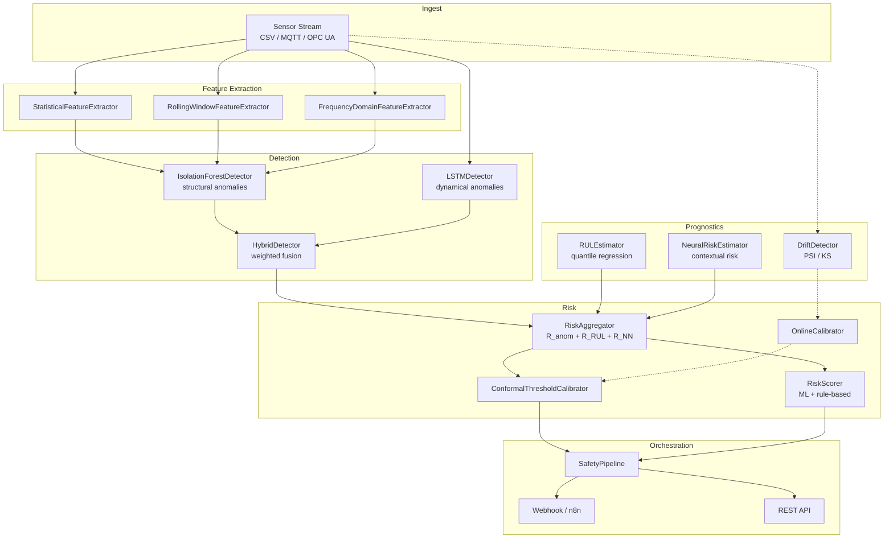

# Architecture
Component-level architecture of **ai-cta** and the rationale behind
the main design decisions. References to monograph chapters are given
in parentheses (e.g., § 8.4).
## Design goals
The framework targets a specific operating regime: **dense multivariate
sensor streams from industrial equipment where the cost of a missed
detection is high and the cost of a false alarm is also non-trivial**
(false alarms fatigue operators and erode trust in the system).
Three properties follow:
1. **Layered detection.** No single algorithm captures all failure
   modes. We run multiple detectors with complementary inductive biases
   and fuse their outputs (§ 8.4).
2. **Interpretable risk.** The final risk score must be partly
   reducible to physical thresholds so domain experts can audit it
   (§ 8.5).
3. **Calibrated thresholds.** Decision thresholds must provide a
   controlled false-alarm rate; a raw anomaly score does not (§ 9.3).
## Component map

Solid arrows: synchronous data flow. Dashed arrows: monitoring loop —
drift detection triggers periodic recalibration of the conformal
threshold.
## Component details
### Feature extraction (`ai_cta.features`)
Three extractors cover the dimensions of signal behaviour that most
industrial fault modes perturb:
- **Statistical** features — mean, std, min/max, RMS, peak-to-peak,
  skewness, kurtosis, crest factor. The crest factor (peak / RMS) is
  particularly informative for bearing pitting and gear-tooth defects.
- **Rolling-window** features compute the same statistics
  incrementally along a time axis, enabling online monitoring without
  re-segmenting the stream.
- **Frequency-domain** features describe the spectral envelope:
  centroid, bandwidth, total energy, dominant frequency. Mechanical
  faults often manifest as distinct frequency components (e.g.
  unbalance at 1× running speed, misalignment at 2×, bearing
  outer-race at the BPFO).
All three follow the scikit-learn `BaseEstimator` /
`TransformerMixin` interface, so they compose with
`sklearn.pipeline.Pipeline`.
### Anomaly detection (`ai_cta.detection`)
- **IsolationForestDetector** — windows are treated as exchangeable
  samples; an Isolation Forest over engineered features detects
  structural outliers. Scores are calibrated to [0, 1] via a logistic
  squashing.
- **LSTMDetector** — windows are *not* exchangeable; what matters is
  how well the next sample can be predicted. A stacked LSTM trained
  as a one-step-ahead forecaster produces residuals; modified z-score
  (median / MAD, robust to training-time outliers) maps them to a
  score.
- **HybridDetector** — convex combination of the two; `tune_weights()`
  finds the F1-optimal mix on a labelled validation split.
### Prognostics (`ai_cta.prognostics`)
- **RULEstimator** — multi-quantile LSTM regressor for Remaining
  Useful Life prediction (§ 9.6). Uses the pinball loss to produce
  calibrated confidence intervals; `risk_at_horizon()` recovers the
  R_RUL component defined in § 8.3.2.
- **NeuralRiskEstimator** — feedforward network mapping (recent
  telemetry, operational context, asset history) to a probability of
  failure within a target horizon (§ 8.3.3). Trained with a
  cost-asymmetric BCE loss that penalises missed events more than
  false alarms.
- **DriftDetector** — monitors distribution shift between a fitted
  reference window and an incoming current window using either
  Population Stability Index (PSI) or the Kolmogorov-Smirnov test
  (with optional Bonferroni correction).
- **OnlineCalibrator** — sliding buffer of recently observed normal
  scores; on a configurable schedule (time and sample count), recomputes
  the conformal threshold so the operational FAR target stays
  satisfied as the data distribution slowly evolves.
### Risk (`ai_cta.risk`)
- **ConformalThresholdCalibrator** — split conformal prediction with
  finite-sample correction. Given a held-out calibration set of
  scores from known-normal data, picks the (1 − α)-quantile that
  guarantees marginal FAR ≤ α under exchangeability.
- **RiskScorer** — combines the ML score with per-channel rule-based
  exceedances. Each channel has a `ChannelLimits` object specifying
  `warn_low` / `warn_high` / `alarm_low` / `alarm_high`. The
  rule-based contribution is piecewise-linear from 0 (well inside the
  warning band) to 1 (beyond the alarm threshold).
- **RiskAggregator** — three-component fusion (§ 8.4):
      R_final = w₁ R_anom + w₂ R_RUL + w₃ R_NN
  with w_i ≥ 0, Σ w_i = 1. `calibrate_weights()` solves for the
  F1-optimal w on the simplex via SLSQP. Default thresholds map
  R_final to OK / Warning / Critical / Emergency per § 8.4.3.
### Streaming (`ai_cta.streaming`)
**SafetyPipeline** is the glue: consumes an iterable of dict readings
(timestamp, channel values), buffers a sliding window, invokes the
detector, computes the composite risk, maps it to a discrete level,
and yields a `PipelineEvent` per step. An optional `alert_callback`
fires whenever the risk crosses `alert_threshold`; the built-in
`make_webhook_callback` posts the event to an HTTP endpoint in
n8n-compatible JSON.
### REST API (`api/`)
A FastAPI service (§ 10.8) exposes the pipeline as HTTP endpoints
(`/score`, `/score-batch`, `/health`, `/version`) with auto-generated
Swagger documentation at `/docs`. Loads a default pipeline at startup
so the service is immediately usable for prototyping.
### Container deployment (`docker/`)
A reference docker-compose stack (§ 12.5) brings up the API, an n8n
workflow orchestrator, and the supporting Postgres + Redis services.
Production deployments add MLflow, Grafana, Prometheus, and InfluxDB.
## Design rationale
- **Why three risk components?** No single estimator captures all
  patterns. R_anom catches sharp deviations from the training
  distribution; R_RUL catches gradual degradation that stays in-
  distribution moment-to-moment; R_NN captures supervised patterns
  that exploit historical incidents and asset context.
- **Why split conformal instead of a fixed threshold?** Because the
  distribution of anomaly scores depends on the detector, scaling,
  data, and seed. Asking the user to pick "0.5 is anomalous" is
  unsound. Asking them to pick a target false-alarm rate is both
  natural and testable.
- **Why a rule-based track at all?** Industrial operators have hard-
  won knowledge encoded in their PLC limits. Ignoring it is both
  disrespectful and unsafe. The composite score surfaces ML insight
  without overriding operational trip points.
- **Why drift detection alongside conformal calibration?** Conformal
  guarantees hold under exchangeability; once that breaks (slow
  process drift, equipment changes), the FAR drifts too. The drift
  detector flags the breach; the online calibrator refits on the
  new regime.
- **Why n8n for alerts?** Free, open source, widely adopted in OT
  automation. The pipeline only depends on an HTTP webhook, so
  substituting Kafka, MQTT, or a custom SCADA adapter is a matter of
  replacing the callback.
## Non-goals
- **Real-time scheduling guarantees.** This is a Python reference
  implementation. Hard real-time constraints require a different
  stack (C++, RTOS, or FPGA).
- **Certification-grade verification.** No part of the code has been
  subjected to the traceability and V&V process required by
  IEC 61508 or equivalent. See [`SECURITY.md`](../SECURITY.md).
- **Production-scale data management.** There is no built-in feature
  store, model registry, or lineage tracker. Integrate with MLflow,
  Feast, or similar if needed.
